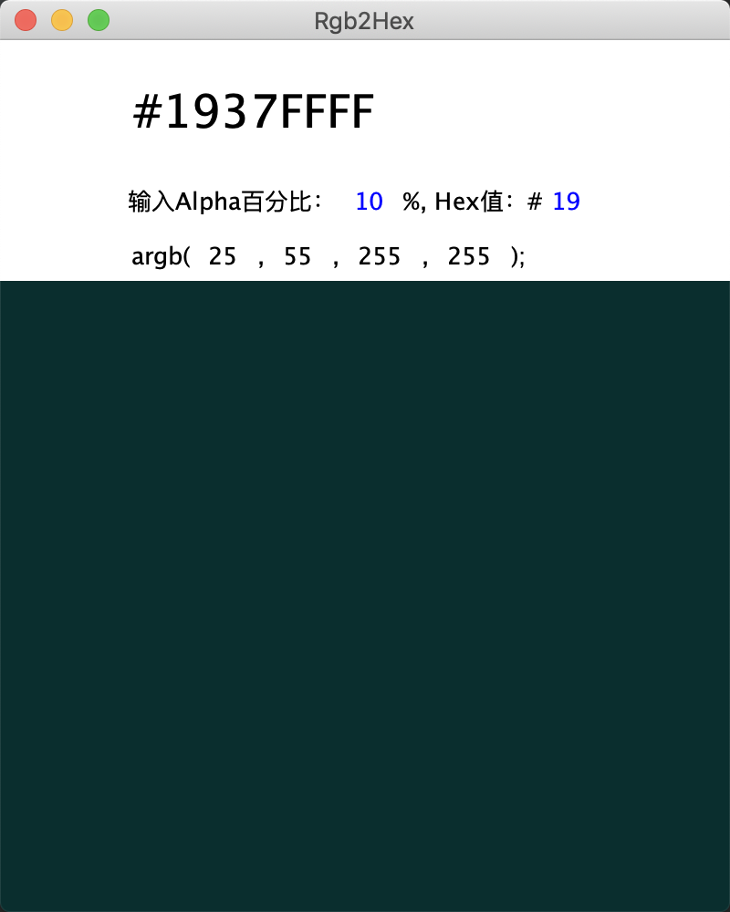
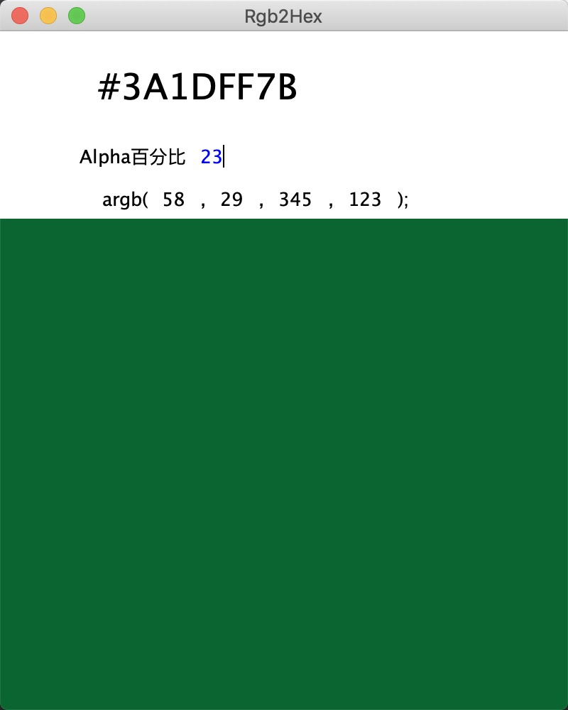

ARGB 2 HEX

>每次设计同学给的一堆rgb的数值，特别是有时还会加上xx%的透明度，苦逼的事要把这个百分数转成16进制，所以自己写了个工具。
>

百分比、argb的数字是可以改变的

**加入``calcolor.sh``命令行使用，无界面**

#### 使用
> 由于本人使用 MackPro 只提供macOS下自己的配置方式

1. 将Rgb2Hex.jar下载到本地

    ``例如：~/ubin/ ``

2. 配置.bash_profile文件
>如果使用zsh，请自行配置

    ``alias rgb2hex='java -jar ~/ubin/Rgb2Hex.jar >/dev/null 2>&1 &' ``

3. 使用的时候，在控制台输如``rgb2hex`` 即可

----

----

